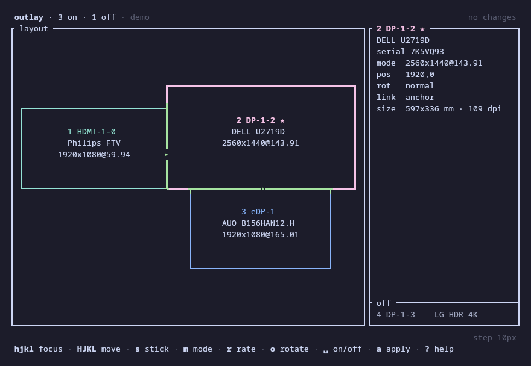
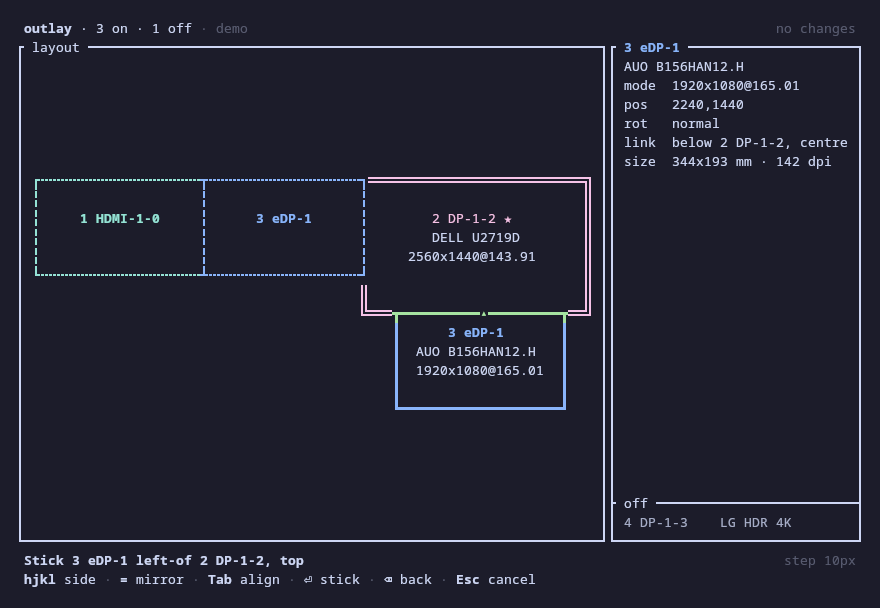
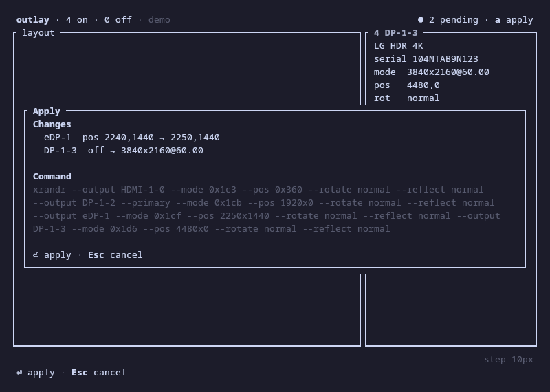
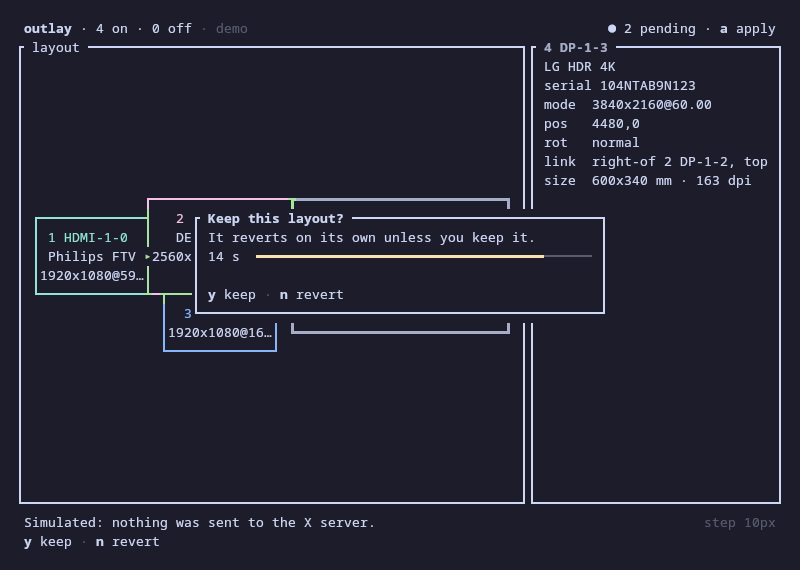
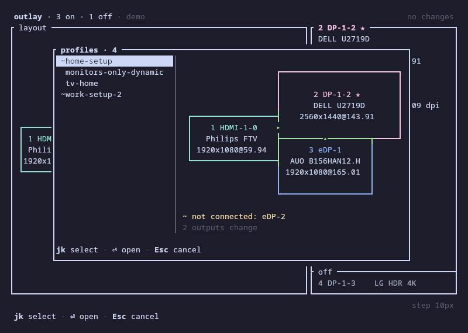

# outlay

A keyboard-driven xrandr layout editor for the terminal. outlay draws your monitors to scale,
lets you arrange them with `h j k l`, sticks a display to a chosen side of another so it follows
when that one changes, and applies the result with an automatic revert if you do not confirm it.
It reads and writes the same `~/.screenlayout` scripts as arandr.



## Why

arandr needs a mouse. The existing xrandr TUIs (vrandr, tuirandr, trandr) are list- and
menu-driven. outlay is built around a spatial canvas instead:

- **To scale.** The layout is drawn in proportion, with the shared edges (where the mouse
  crosses from one screen to the next) in green and overlaps hatched in red, so you can check it
  before applying.
- **Stick links.** A display stuck to the right of another stays there when that one changes
  mode, rotates or moves. Links are inferred from touching edges, so an existing layout already
  has them.
- **Snap and swap.** `Shift` + a direction swaps a display with its neighbour or slides it to
  the next edge that lines up; `Alt` + a direction nudges it freely, faster the longer you hold.
- **A safety net.** An apply is checked against what xrandr actually did, and reverts after
  15 seconds unless you keep it, so a layout that leaves you with a black screen fixes itself.

| | arandr | outlay |
|---|---|---|
| Arrange displays | drag with the mouse | `h j k l`, snap, swap, nudge |
| Keeps a display attached to another | no | stick links that re-flow |
| Changes modes and rates | menus | pickers, `[` `]` `{` `}` in place |
| Confirms a new layout | no | verifies, then reverts unless kept |
| Profiles | `~/.screenlayout/*.sh` | the same files, with a remap for renamed outputs |

## Install

outlay needs Linux with an X11 session and the `xrandr` program at run time (`xorg-xrandr` on
Arch, `x11-xserver-utils` on Debian and Ubuntu, `xrandr` on Fedora, openSUSE, Void and Alpine).
Wayland compositors need their own tools, such as wlr-randr, kanshi or `hyprctl`.

Build it with Rust 1.91 or newer:

```sh
git clone https://github.com/Papayah/outlay && cd outlay
cargo build --release
install -Dm755 target/release/outlay ~/.local/bin/outlay
```

For one static binary that runs on any distribution:

```sh
rustup target add x86_64-unknown-linux-musl
cargo build --release --target x86_64-unknown-linux-musl
```

Shell completions: `outlay completions bash > ~/.local/share/bash-completion/completions/outlay`,
or `zsh`, `fish`, `elvish`, `powershell`.

## Try it without touching your screens

```sh
outlay --demo                 # a built-in desk with four outputs
outlay --from-file capture    # a saved `xrandr --verbose` output
outlay -n                     # your live state; applies are only simulated
```

The whole apply flow, countdown and revert included, works in all three.

## Usage

```
outlay                      open the editor (default)
outlay show                 print the to-scale diagram and output table, then exit
outlay list                 list outputs, then resolutions with their rates
outlay apply <profile>      apply ~/.screenlayout/<profile>.sh or a path (-n prints the command only)
outlay save <profile>       save the live layout as an arandr-compatible script
outlay keys                 print the keymap
outlay completions <shell>  print a completion script
```

Global flags: `--demo`, `--from-file <capture>`, `-n`, `--layouts-dir <dir>`,
`--revert-timeout <s>` (`0` turns the countdown off), `--no-anim`.

## Keys

| Key | Action |
|---|---|
| `h j k l`, arrows | focus the nearest display in that direction; `Tab`, `1`–`9` also focus |
| `H J K L`, Shift-arrows | snap-move: swap with the neighbour, or slide to the next aligned edge |
| `Alt-h j k l`, Alt-arrows | nudge by the step; holding the key speeds it up to ×10 |
| `+` `-` | nudge step: 1, 5, 10, 50 or 100 px |
| `s` / `S` | stick to a side of another display / unstick |
| `m` / `[` `]` | resolution picker / next smaller or larger resolution |
| `r` / `{` `}` | rate picker / next lower or higher rate |
| `o` / `O` | rotate clockwise / counter-clockwise |
| `p`, `Space` | make primary, turn on or off |
| `u` / `Ctrl-r` | undo / redo |
| `a` | apply, with the automatic revert |
| `y` | copy the pending xrandr command (OSC 52) |
| `w` / `e` | save a profile / open one |
| `:` | command line (`:pos 1920 0`, `:stick 3 below 2 center`, `:e home`; `Tab` completes) |
| `R`, `z`, `i`, `?`, `q` | refresh (keeps your edits), re-fit the view, details panel, help, quit |

A display you plug in while outlay is open shows up in the off list by itself within about two
seconds, with focus on it, so `Space` turns it on. One you unplug while it is on is turned off in
the pending layout, and `u` brings it back. Pending edits and undo survive both; `R` does the same
at once, with a full probe of the outputs.

`Esc` closes popups and cancels; it never quits. `?` and `outlay keys` list every binding and
command, generated from the same table the editor dispatches from.

### Sticking

`s` starts the stick flow: pick the target (a digit, `h j k l` or `Tab`, then `Enter`), then the
side (`h j k l`, or `=` to mirror) and the alignment along the shared edge (`Tab`). A dashed
outline shows where everything would go. `s 2 h Enter` sticks the focused display to the left of
display 2.



## Applying safely

`a` shows the per-output changes, any errors that block the apply, and the exact xrandr command.



After xrandr returns, outlay reads the state back and checks it against the request (xrandr
exits 0 even when it ignores an output). Then it asks "Keep this layout?" for 15 seconds: only
`y` keeps it. A timeout, `n`, `Esc`, Ctrl-C, SIGHUP or SIGTERM revert to the previous layout.
Keys pressed in the first second after xrandr returns are ignored, so one pressed while the
screens were dark cannot answer. Before each apply, outlay writes the revert command to
`$XDG_STATE_HOME/outlay/revert.sh`, so you can run it by hand if anything goes wrong.



## Profiles

Profiles are arandr-style scripts in `~/.screenlayout` (`--layouts-dir` or `layouts_dir` in the
config point elsewhere), so arandr and outlay read each other's files. In the editor, `e` opens a
picker that draws each profile to scale; opening one makes its layout the pending one (one `u`
undoes it), and `a` applies it as usual. `w` saves the pending layout: an existing script keeps
every line that is not an xrandr call, and outlay shows a diff and asks before overwriting it.
When a profile names an output that is not connected (`eDP-2` on a laptop that now calls its
panel `eDP-1`), a dialog asks where it goes, starting from a free output of the same kind.



From the shell, `outlay apply home` applies `~/.screenlayout/home.sh` with the same verification
and countdown (type `y` and Enter to keep it; `--revert-timeout 0` keeps it without asking, for
key bindings), and `outlay save home` saves the live layout (`-f` overwrites a different file
without asking). With `-n`, both only print what they would run or write.

## Configuration

`$XDG_CONFIG_HOME/outlay/config.toml` is optional; every key has a default:

```toml
revert_seconds = 15
nudge_step = 10
layouts_dir = "~/.screenlayout"
animations = true
directions = "hjkl"        # focus letters: left, down, up, right
# cell_aspect = 2.0        # detected from the terminal when omitted
double_borders = false     # true: double border on the stick target and the focused display's parent
post_apply = []            # e.g. ["feh --bg-fill ~/Pictures/wallpapers/*"]; see below
post_apply_timeout = 10    # seconds each post_apply command may run
```

`NO_COLOR` turns colours off; the focused display is still marked in reverse video.

### Redraw the wallpaper

A layout change leaves most wallpaper setters' image stretched, cut off or missing on the moved
displays. `post_apply` lists commands that put it back. They run after every change outlay makes
to the screens: once an apply checks out (before the countdown, so you judge the layout as it
will look), and again after every revert, whether it came from the timeout, `n`, a signal or a
failed apply. They do not run on keep, since nothing changes then.

Each command runs with `sh -c`, with no terminal: stdin and stdout go nowhere, and when a command
fails, the status line shows the first line of its stderr. A command that takes longer than
`post_apply_timeout` seconds is stopped. `sh` does not know your shell's aliases, so write the
command itself or the path of a script. Common ones:

- feh: `feh --bg-fill ~/wall/*`, or `sh ~/.fehbg` (feh writes that restore file itself)
- nitrogen: `nitrogen --restore`
- xwallpaper: `xwallpaper --zoom ~/wall.jpg`
- hsetroot: `hsetroot -fill ~/wall.jpg`
- your own script: `~/bin/my-wallpaper.sh`

```toml
post_apply = ["sh ~/.fehbg"]
post_apply_timeout = 10
```

outlay does not wait for a program a command leaves running in the background (`… &`); send
that program's output elsewhere (`>/dev/null 2>&1 &`) so it outlives outlay without trouble.
The hooks never run with `--demo`, `--from-file` or `-n`, which do not touch the screens.

## License

outlay is free software: you can redistribute it and/or modify it under the terms of the GNU
General Public License, version 3 or (at your option) any later version. See [`LICENSE`](LICENSE).
