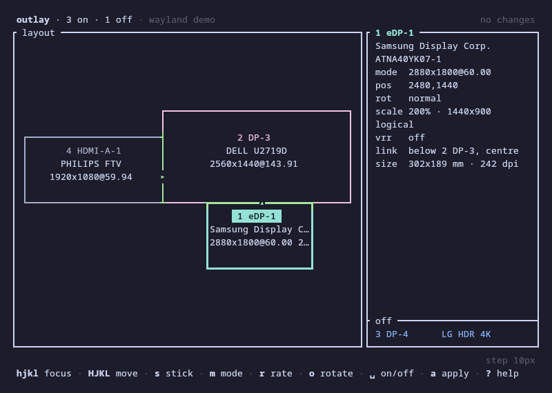
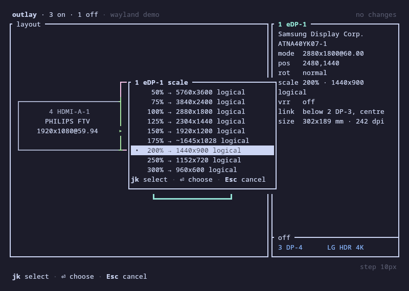
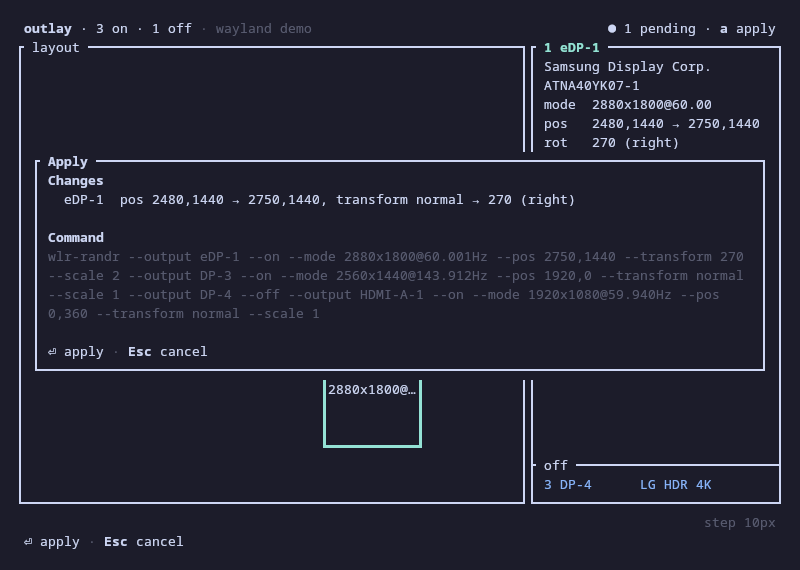

# outlay

A keyboard-driven monitor layout editor for the terminal, on X11 and on wlroots-based Wayland
compositors. outlay draws your monitors to scale, lets you arrange them with `h j k l`, sticks a
display to a chosen side of another so it follows when that one changes, and applies the result
with an automatic revert if you do not confirm it. It reads and writes the same `~/.screenlayout`
scripts as arandr on X11, and kanshi profiles on Wayland.


## Install

```sh
curl -fsSL https://github.com/Papayah/outlay/releases/latest/download/install.sh | sh
```

This installs a static binary for x86_64 or aarch64 Linux to `~/.local/bin/outlay`, with shell
completions. Run the same command again to update.

On X11, outlay needs the `xrandr` program (`xorg-xrandr` on Arch, `x11-xserver-utils` on Debian
and Ubuntu, `xrandr` on Fedora, openSUSE, Void and Alpine). On Wayland it talks to the compositor
itself and needs nothing else: sway, Hyprland, niri, river, labwc, Wayfire and the other
compositors that offer wlr-output-management work. GNOME and KDE Plasma do not yet. See
[Wayland](#wayland) for what differs there.

For options, end the line with `sh -s --` and add them: `--version 0.1.0` installs that release,
`--to DIR` installs into another directory, and `--uninstall` removes outlay again (`--help` lists
the rest). To build it yourself, see [Build from source](#build-from-source).

## Why

arandr needs a mouse. The existing xrandr TUIs (vrandr, tuirandr, trandr) are list- and
menu-driven. outlay is built around a spatial canvas instead:

- **To scale.** The layout is drawn in proportion, with the shared edges (where the mouse
  crosses from one screen to the next) in green and overlaps hatched in red, so you can check it
  before applying.
- **Stick links.** A display stuck to the right of another stays there when that one changes
  mode, rotates or moves. Links are inferred from touching edges, so an existing layout already
  has them.
- **Snap and swap.** `Shift` + a direction swaps a display with its neighbour or slides it to
  the next edge that lines up; `Alt` + a direction nudges it freely, faster the longer you hold.
- **A safety net.** An apply is checked against what the display server actually did, and
  reverts after 15 seconds unless you keep it, so a layout that leaves you with a black screen
  fixes itself.

| | arandr | outlay |
|---|---|---|
| Arrange displays | drag with the mouse | `h j k l`, snap, swap, nudge |
| Keeps a display attached to another | no | stick links that re-flow |
| Changes modes, rates and scale | menus | pickers, `[` `]` `{` `}` `<` `>` in place |
| Confirms a new layout | no | verifies, then reverts unless kept |
| Profiles | `~/.screenlayout/*.sh` | the same files, with a remap for renamed outputs |
| Wayland | no | wlroots compositors, with kanshi profiles |

On Wayland, wdisplays needs a mouse, wlr-randr is a one-shot command, kanshi applies profiles but
does not edit them, and xwlm is a list. None of them draws the layout to scale, keeps displays
stuck together, or reverts a layout you did not confirm.

## Try it without touching your screens

```sh
outlay --demo                 # a built-in desk with four outputs
outlay --demo=wayland         # the same desk as a Wayland compositor reports it
outlay --from-file capture    # a saved `xrandr --verbose`, `wlr-randr --json` or `outlay dump`
outlay -n                     # your live state; applies are only simulated
```

The whole apply flow, countdown and revert included, works in all three.

## Usage

```
outlay                      open the editor (default)
outlay show                 print the to-scale diagram and output table, then exit
outlay list                 list outputs, then resolutions with their rates
outlay apply <profile>      apply ~/.screenlayout/<profile>.sh or a path; on Wayland, a kanshi profile
                            (-n prints the command only)
outlay save <profile>       save the live layout as an arandr-compatible script, or a kanshi profile
outlay keys                 print the keymap
outlay dump                 print the state as read (xrandr --verbose, or JSON on Wayland)
outlay completions <shell>  print a completion script
```

Global flags: `--demo`, `--from-file <capture>`, `-n`, `--layouts-dir <dir>`,
`--kanshi-config <file>`, `--revert-timeout <s>` (`0` turns the countdown off), `--no-anim`.

## Keys

| Key | Action |
|---|---|
| `h j k l`, arrows | focus the nearest display in that direction; `Tab`, `1`–`9` also focus |
| `H J K L`, Shift-arrows | snap-move: swap with the neighbour, or slide to the next aligned edge |
| `Alt-h j k l`, Alt-arrows | nudge by the step; holding the key speeds it up to ×10 |
| `+` `-` | nudge step: 1, 5, 10, 50 or 100 px |
| `s` / `S` | stick to a side of another display / unstick |
| `m` / `[` `]` | resolution picker / next smaller or larger resolution |
| `r` / `{` `}` | rate picker / next lower or higher rate |
| `x` / `<` `>` | scale picker / next smaller or larger scale (on X11, a larger scale is a larger desktop) |
| `o` / `O` | rotate clockwise / counter-clockwise |
| `p`, `Space` | make primary (X11), turn on or off |
| `u` / `Ctrl-r` | undo / redo |
| `a` | apply, with the automatic revert |
| `y` | copy the pending command, xrandr's or the equivalent wlr-randr one (OSC 52) |
| `w` / `e` | save a profile / open one |
| `:` | command line (`:pos 1920 0`, `:scale 1.25`, `:stick 3 below 2 center`, `:e home`; `Tab` completes) |
| `R`, `z`, `i`, `?`, `q` | refresh (keeps your edits), re-fit the view, details panel, help, quit |

A display you plug in while outlay is open shows up in the off list by itself within about two
seconds, with focus on it, so `Space` turns it on. One you unplug while it is on is turned off in
the pending layout, and `u` brings it back. Pending edits and undo survive both; `R` does the same
at once, with a full probe of the outputs.

`Esc` closes popups and cancels; it never quits. `?` and `outlay keys` list every binding and
command, generated from the same table the editor dispatches from.

### Sticking

`s` starts the stick flow: pick the target (a digit, `h j k l` or `Tab`, then `Enter`), then the
side (`h j k l`, or `=` to mirror) and the alignment along the shared edge (`Tab`). A dashed
outline shows where everything would go. `s 2 h Enter` sticks the focused display to the left of
display 2.


## Applying safely

`a` shows the per-output changes, any errors that block the apply, and the exact xrandr command
(on Wayland, the equivalent wlr-randr command; outlay talks to the compositor itself).


After xrandr returns, outlay reads the state back and checks it against the request (xrandr
exits 0 even when it ignores an output). Then it asks "Keep this layout?" for 15 seconds: only
`y` keeps it. A timeout, `n`, `Esc`, Ctrl-C, SIGHUP or SIGTERM revert to the previous layout,
and outlay reads the state back again to check that the revert restored it. Keys pressed in the first second after xrandr returns are ignored, so one pressed while the
screens were dark cannot answer. Before each apply, outlay writes the revert command to
`$XDG_STATE_HOME/outlay/revert.sh`, so you can run it by hand if anything goes wrong; a revert
that did not restore everything says so and points to it.


## Profiles

On X11, profiles are arandr-style scripts in `~/.screenlayout` (`--layouts-dir` or `layouts_dir`
in the config point elsewhere), so arandr and outlay read each other's files; on Wayland they are
[kanshi profiles](#kanshi-profiles). In the editor, `e` opens a picker that draws each profile to
scale; opening one makes its layout the pending one (one `u` undoes it), and `a` applies it as
usual. `w` saves the pending layout: an existing script keeps
every line that is not an xrandr call, and outlay shows a diff and asks before overwriting it.
When a profile names an output that is not connected (`eDP-2` on a laptop that now calls its
panel `eDP-1`), a dialog asks where it goes, starting from a free output of the same kind.


From the shell, `outlay apply home` applies `~/.screenlayout/home.sh` with the same verification
and countdown (type `y` and Enter to keep it; `--revert-timeout 0` keeps it without asking, for
key bindings), and `outlay save home` saves the live layout (`-f` overwrites a different file
without asking). With `-n`, both only print what they would run or write.

## Wayland

outlay drives the compositor through `zwlr_output_manager_v1` (wlr-output-management): sway,
Hyprland, niri, river, labwc, Wayfire, COSMIC and the other compositors that offer it. GNOME and
KDE Plasma have their own protocols and are not supported yet; outlay says so and names their
display settings. Weston and gamescope do not offer the protocol.



What differs from X11:

- **No primary display and no mirroring.** The protocol has neither. `p`, `:primary` and the
  mirror side of `s` say so instead of acting, and two displays with the same rectangle show as
  an overlap.
- **The scale goes the other way.** At 150 %, a display shows everything larger: it covers its
  mode divided by the scale, so a 2880x1800 panel at 200 % takes 1440x900 of the layout, and
  positions are in these logical pixels. On X11, `--scale` makes a larger desktop instead. The
  badge and the picker say `150%` on Wayland and `×1.5` on X11.
- **Transforms go by their protocol names,** with xrandr's word after them: `90 (left)`. The
  protocol's 90 turns counter-clockwise, which xrandr calls `left`; wlr-randr and kanshi use the
  same names, but sway's own config and `swaymsg` name the turns the other way round (sway's `90`
  is the protocol's `270`). Only reflections in `x` exist, so `:reflect y` becomes `x` turned
  upside down. `:rotate` takes `90`, `180` and `270` as well as the words.
- **The compositor checks a layout first.** One it rejects is never applied. (Hyprland accepts
  every check.)
- **Variable refresh is shown, never changed.**





### kanshi profiles

On Wayland, `w`, `e`, `outlay apply` and `outlay save` use the profiles in kanshi's config
(`$XDG_CONFIG_HOME/kanshi/config`; `--kanshi-config` or `kanshi_config` point elsewhere), which
kanshi applies whenever displays are plugged in or out. outlay reads the config as kanshi does,
with `include`s, global `output` defaults and `$alias`es, and matches outputs as kanshi does: by
name, by a glob on `Make Model Serial` (with `Unknown` for a field the display does not report),
or with `*`. A profile output that matches no display goes to the remap dialog, which offers a
free display of the same make and model. `exec` commands and `...output` entries stay in the
file; outlay neither runs nor matches them, and says so.

Saving rewrites only that profile's `output` lines, under the criteria you wrote, and the
`# generated by outlay` line above the block; a new profile goes at the end. Everything else in
the file stays byte for byte, comments and `exec` lines inside the block too. A display the
profile did not name yet gets its description, so the profile follows the monitor to any port;
built-in panels, and displays that do not report a make, model and serial of their own, go by
name. outlay shows the diff and asks before it writes. It never reloads kanshi: run
`kanshictl reload` afterwards.

### How long a change lasts

A layout outlay applies is the compositor's state until something replaces it:

- **sway** keeps it until `swaymsg reload`, which applies the `output` lines of sway's config
  again.
- **niri** keeps it until the `output` sections of its config change.
- **Hyprland** ties it to the client that made it. outlay disconnects when it exits, and Hyprland
  drops the change at its next config reload or hotplug. To keep a layout there, save it as a
  kanshi profile (kanshi stays connected) or write it into Hyprland's config.
- **kanshi** keeps the profile it applied while the same displays stay connected, so it lets an
  outlay apply stand, countdown included. It applies its profile again when a display is plugged
  in or out, and on `kanshictl reload`. To keep a layout across hotplugs, save it with `w` and
  reload kanshi.

### Reverting

On Wayland, `revert.sh` runs `outlay restore -` with the state from before the apply, so it needs
no other program. `outlay dump` prints the live state in the same format, `wlr-randr --json`'s,
which `--from-file` reads too: attach it to a bug report.

## Configuration

`$XDG_CONFIG_HOME/outlay/config.toml` is optional; every key has a default:

```toml
revert_seconds = 15
nudge_step = 10
layouts_dir = "~/.screenlayout"
# kanshi_config = "~/.config/kanshi/config"   # Wayland profiles; default: the file kanshi reads
animations = true
directions = "hjkl"        # focus letters: left, down, up, right
# cell_aspect = 2.0        # detected from the terminal when omitted
double_borders = false     # true: double border on the stick target and the focused display's parent
post_apply = []            # e.g. ["feh --bg-fill ~/Pictures/wallpapers/*"]; see below
post_apply_timeout = 10    # seconds each post_apply command may run
```

`NO_COLOR` turns colours off; the focused display is still marked in reverse video.

### Redraw the wallpaper

A layout change leaves most wallpaper setters' image stretched, cut off or missing on the moved
displays. `post_apply` lists commands that put it back. They run after every change outlay makes
to the screens: once an apply checks out (before the countdown, so you judge the layout as it
will look), and again after every revert, whether it came from the timeout, `n`, a signal or a
failed apply. They do not run on keep, since nothing changes then.

Each command runs with `sh -c`, with no terminal: stdin and stdout go nowhere, and when a command
fails, the status line shows the first line of its stderr. A command that takes longer than
`post_apply_timeout` seconds is stopped. `sh` does not know your shell's aliases, so write the
command itself or the path of a script. Common ones:

- feh: `feh --bg-fill ~/wall/*`, or `sh ~/.fehbg` (feh writes that restore file itself)
- nitrogen: `nitrogen --restore`
- xwallpaper: `xwallpaper --zoom ~/wall.jpg`
- hsetroot: `hsetroot -fill ~/wall.jpg`
- your own script: `~/bin/my-wallpaper.sh`

```toml
post_apply = ["sh ~/.fehbg"]
post_apply_timeout = 10
```

outlay does not wait for a program a command leaves running in the background (`… &`); send
that program's output elsewhere (`>/dev/null 2>&1 &`) so it outlives outlay without trouble.
The hooks never run with `--demo`, `--from-file` or `-n`, which do not touch the screens.

## Build from source

With Rust 1.91 or newer:

```sh
cargo install --git https://github.com/Papayah/outlay --locked
```

Or from a clone:

```sh
git clone https://github.com/Papayah/outlay && cd outlay
cargo build --release
install -Dm755 target/release/outlay ~/.local/bin/outlay
```

For one static binary that runs on any distribution, as the releases are built:

```sh
rustup target add x86_64-unknown-linux-musl
cargo build --release --target x86_64-unknown-linux-musl
```

Shell completions: `outlay completions bash > ~/.local/share/bash-completion/completions/outlay`,
or `zsh`, `fish`, `elvish`, `powershell`.

## License

outlay is free software: you can redistribute it and/or modify it under the terms of the GNU
General Public License, version 3 or (at your option) any later version. See [`LICENSE`](LICENSE).
